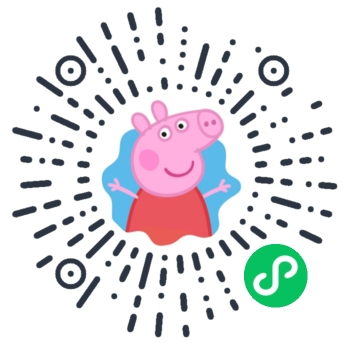
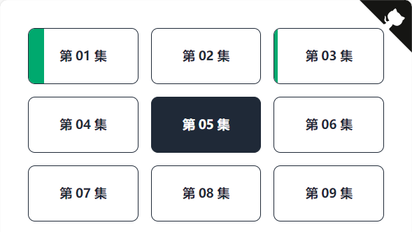
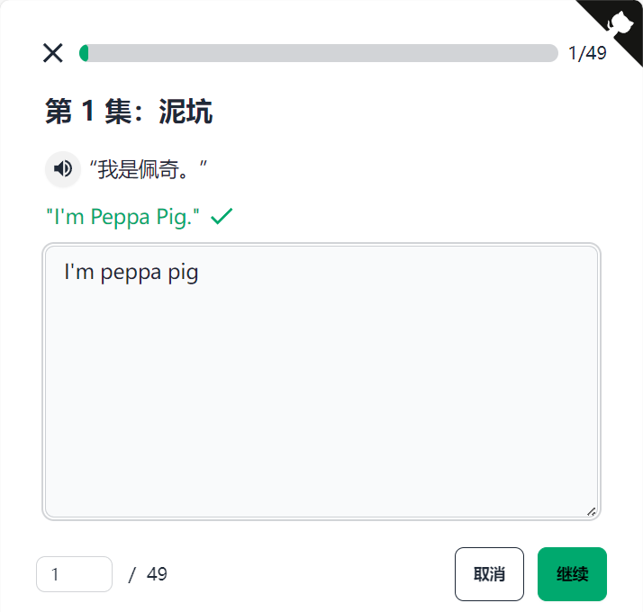

# 挑战 52 天背完小猪佩奇小程序版

网站链接：[Github Page](https://justorez.github.io/peppa/)

 

一个 B 站英语学习教程的配套练习（友情提示：我不是 UP 主😊）。

B 站视频地址：[脑洞部长 /《挑战52天背完小猪佩奇，进来一起卷！》](https://space.bilibili.com/33291981/channel/collectiondetail?sid=525129&ctype=0)

 
 

## 功能

- [x] 支持播放英文句子，用作提示
- [x] 在入口展示每集的总体进度
- [x] 记录分集练习进度（不同浏览器之间不互通）
- [x] 页面展示和英文句子检查
- [x] 练习完一集后，可直接跳转到下一集
